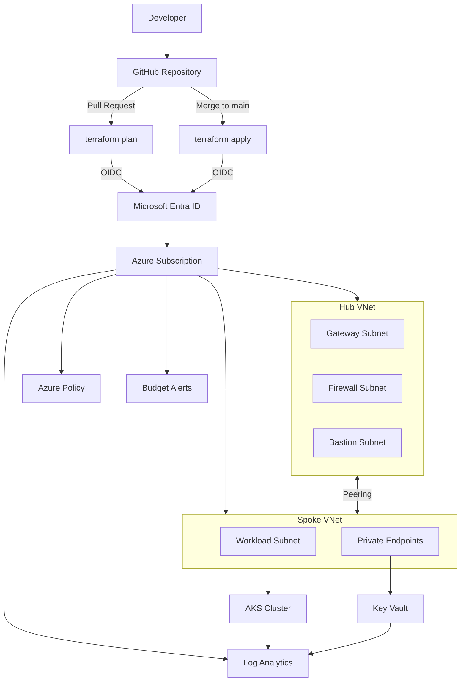

# Terraform Azure Landing Zone


A production-style Azure landing zone using modular Terraform with hub-spoke networking, AKS, Key Vault, Azure Policy, budget alerts, and GitHub Actions CI/CD with OIDC authentication — no stored secrets.

---

## Architecture



---

## Repository Structure

```text
terraform-azure-landing-zone/
├── modules/
│   ├── hub-vnet/              # Hub VNet with Gateway, Firewall, Bastion subnets
│   ├── spoke-vnet/            # Spoke VNet with peering, NSG, workload subnet
│   ├── aks/                   # AKS cluster with autoscaler, managed identity, RBAC
│   ├── key-vault/             # Key Vault with RBAC, diagnostics, purge protection
│   ├── log-analytics/         # Log Analytics workspace with Container Insights
│   ├── azure-policy/          # Tag enforcement, allowed locations, VM SKU restrictions
│   └── budget/                # Consumption budget with multi-threshold alerts
├── environments/
│   ├── dev/                   # Dev environment (Free tier, minimal nodes)
│   │   ├── main.tf
│   │   ├── variables.tf
│   │   ├── outputs.tf
│   │   ├── backend.tf
│   │   └── terraform.tfvars
│   └── prod/                  # Prod environment (Standard tier, HA, policy enforcement)
│       ├── main.tf
│       ├── variables.tf
│       ├── outputs.tf
│       ├── backend.tf
│       └── terraform.tfvars
├── scripts/
│   └── init-backend.sh        # Bootstrap Azure Storage for remote state
├── docs/
│   ├── architecture.md        # Architecture diagrams and design decisions
│   └── deployment-guide.md    # Step-by-step deployment instructions
├── .github/
│   └── workflows/
│       ├── terraform-plan.yml  # Plan on PR with comment output
│       └── terraform-apply.yml # Apply on merge with environment gates
├── .gitignore
├── CONTRIBUTING.md
├── LICENSE
└── README.md
```

---

## Modules

| Module | Purpose | Key Features |
|--------|---------|-------------|
| [`hub-vnet`](modules/hub-vnet/) | Central network hub | Gateway, Firewall, Bastion subnets; optional Bastion host |
| [`spoke-vnet`](modules/spoke-vnet/) | Workload network | Bidirectional peering, NSG with deny-all default, private endpoints subnet |
| [`aks`](modules/aks/) | Kubernetes cluster | Autoscaler, availability zones, Calico network policy, managed identity, RBAC |
| [`key-vault`](modules/key-vault/) | Secrets management | RBAC authorization, purge protection, diagnostic logging, network ACLs |
| [`log-analytics`](modules/log-analytics/) | Centralized monitoring | Container Insights, configurable retention and quotas |
| [`azure-policy`](modules/azure-policy/) | Governance | Required tags, allowed locations, VM SKU restrictions, public IP deny |
| [`budget`](modules/budget/) | Cost governance | 80% actual, 100% actual, 120% forecast alert thresholds |

---

## Tech Stack

| Category | Technology |
|----------|-----------|
| Infrastructure as Code | Terraform (~> 1.5) with AzureRM provider (~> 3.85) |
| Cloud Platform | Microsoft Azure |
| CI/CD | GitHub Actions with OIDC federation |
| Container Orchestration | Azure Kubernetes Service (AKS) |
| Networking | Hub-spoke VNet topology with peering |
| Secrets | Azure Key Vault with RBAC |
| Monitoring | Azure Monitor + Log Analytics + Container Insights |
| Governance | Azure Policy + Consumption Budgets |
| State Management | Azure Storage backend with versioning and delete locks |

---

## Security Design

- **Zero stored credentials** — GitHub Actions authenticates via OIDC federated identity
- **Hub-spoke isolation** — Workloads in spoke VNets, shared services in hub
- **NSG deny-all default** — Explicit allow rules only
- **Private endpoints** — PaaS services accessed over private network
- **RBAC everywhere** — Key Vault, AKS, role assignments via managed identity
- **Azure Policy** — Tag enforcement, region restrictions, VM SKU governance
- **Bastion access** — No public IPs on VMs; management through Azure Bastion

---

## Environment Comparison

| Setting | Dev | Prod |
|---------|-----|------|
| AKS SKU | Free | Standard |
| System nodes | 1–3 × D2s_v5 | 2–5 × D4s_v5 |
| User node pool | Disabled | 2–10 × D4s_v5 |
| Bastion | Disabled | Enabled |
| Log retention | 30 days | 90 days |
| Monthly budget | $500 | $3,000 |
| Public IP policy | Allowed | Denied |
| VM SKU restriction | None | D-series v5 only |

---

## Getting Started

### Prerequisites

- [Terraform >= 1.5.0](https://developer.hashicorp.com/terraform/install)
- [Azure CLI](https://learn.microsoft.com/en-us/cli/azure/install-azure-cli)
- Azure subscription with Contributor access
- GitHub repository with OIDC configured

### Quick Start

```bash
# Clone
git clone https://github.com/Harshithj88/terraform-azure-landing-zone.git
cd terraform-azure-landing-zone

# Initialize state backend
chmod +x scripts/init-backend.sh
./scripts/init-backend.sh dev

# Deploy dev environment
cd environments/dev
terraform init
terraform plan
terraform apply
```

See [docs/deployment-guide.md](docs/deployment-guide.md) for the full setup including OIDC configuration.

---

## CI/CD Pipeline

| Trigger | Workflow | Action |
|---------|----------|--------|
| Pull Request | `terraform-plan.yml` | Runs `terraform plan` for all environments, posts output as PR comment |
| Merge to main | `terraform-apply.yml` | Auto-applies dev; prod requires manual approval via GitHub Environment |
| Manual dispatch | `terraform-apply.yml` | Deploy a specific environment on demand |

---

## Documentation

- [Architecture](docs/architecture.md) — network topology, module dependencies, design decisions
- [Deployment Guide](docs/deployment-guide.md) — OIDC setup, backend init, environment deployment

---

## Related Projects

| Project | Focus |
|---------|-------|
| [aks-platform-bicep-github-actions](https://github.com/Harshithj88/aks-platform-bicep-github-actions) | AKS platform with Bicep IaC and GitHub Actions |
| [aks-sre-platform-lab](https://github.com/Harshithj88/aks-sre-platform-lab) | SRE platform with Helm, Prometheus, Grafana, and SLOs |
| [devops-sre-operations-toolkit](https://github.com/Harshithj88/devops-sre-operations-toolkit) | PowerShell automation for DevOps operations |
| [sre-devops-handbook](https://github.com/Harshithj88/sre-devops-handbook) | Runbooks, checklists, and cheat sheets |

---

## License

This project is licensed under the MIT License. See [LICENSE](LICENSE) for details.
