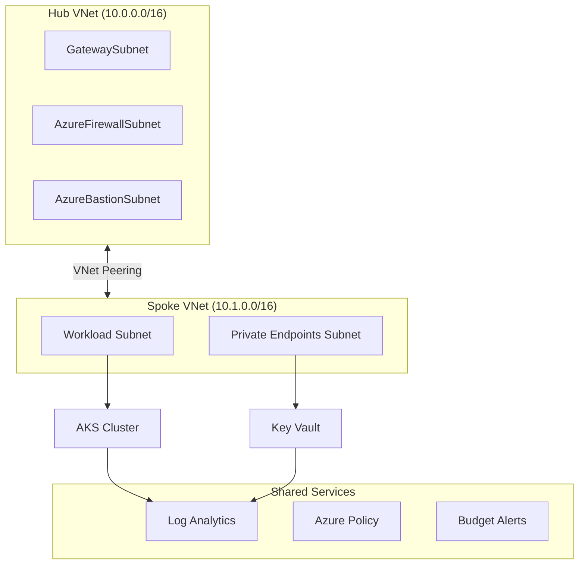
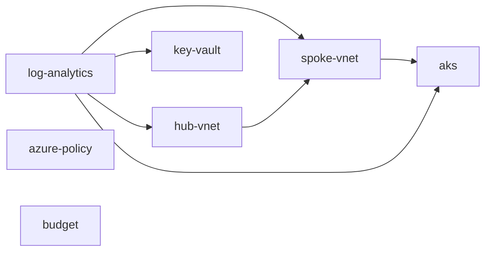

# Architecture

## Overview

This landing zone implements a **hub-spoke network topology** on Azure, following the [Cloud Adoption Framework](https://learn.microsoft.com/en-us/azure/cloud-adoption-framework/) recommended patterns. All infrastructure is defined as Terraform modules and deployed via GitHub Actions with OIDC authentication — no stored credentials.

## Network Topology

## Module Dependency Graph

## Design Decisions

| Decision | Rationale |
|----------|-----------|
| Hub-spoke over flat VNet | Isolation between workloads, centralized network services, aligns with CAF |
| OIDC over service principal secrets | Eliminates credential rotation, follows zero-trust principles |
| Per-environment state files | Independent lifecycle, blast radius containment |
| Azure Bastion over public IPs | Secure management access without exposing VMs to the internet |
| RBAC on Key Vault (not access policies) | Granular permissions, Azure AD integration, audit trail |
| Calico network policy on AKS | Namespace-level microsegmentation, industry standard |
| Consumption budgets with alerts | Cost governance without blocking — alert at 80%, 100%, 120% forecast |

## Security Controls

- **Network**: NSG deny-all default, private endpoints for PaaS, no public IPs (policy enforced in prod)
- **Identity**: Managed identities for AKS, OIDC for CI/CD, RBAC everywhere
- **Governance**: Azure Policy for tag enforcement, allowed regions, VM SKU restrictions
- **Secrets**: Key Vault with RBAC, purge protection, diagnostic logging
- **Monitoring**: Log Analytics with Container Insights, 90-day retention in prod
